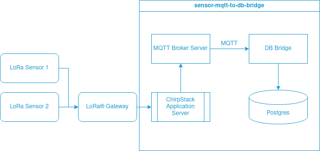

  
# sensor-mqtt-to-db-bridge
A bridging connector designed to facilitate the transfer of data from ChirpStack utilizing MQTT/AMQP to a database.


## Structure

*Rabbit MQ version is released in **amqp** branch.

  

## Feature

-   Consumer topic filter
	+ Support wildcard topic (MQTT only)

-   Consumer protocol version
    + Support v3.1/3.1.1 in AMQP
    + Support v3.1/3.1.1/5 in MQTT

-   Create record in Postgres


## Config
Rename **config.toml.example** to **config.toml**
```
[mqtt]
host = "localhost"
port = 1883
username = ""
password = ""
topic_filter = [
    "application/+/device/+/event/up"
]

[db]
dbhost = "localhost"
port = 5500
username = "postgres"
password = "postgres"
db_name = "iot"
table = "lorawan_raw_data"
```


## Use cases
+ 1 Deployment for 1 project
+ Each deployment should subscribe <1500 routing keys

### Test Environment
**DO NOT use the following setting in production environment !!**
- MQTT Broker
    ```
    docker run -it -p 1883:1883 -p 9001:9001 -v mosquitto.conf:/mosquitto/config/mosquitto.conf eclipse-mosquitto:2.0.18
    ```
    mosquitto.conf
    ```
    listener 1883
    allow_anonymous true
    ```

- Postgres
    ```
    docker run -it --name test-pg -p 5500:5432 -e POSTGRES_PASSWORD=postgres -e POSTGRES_DB=iot -d postgres:15-alpine
    ```


